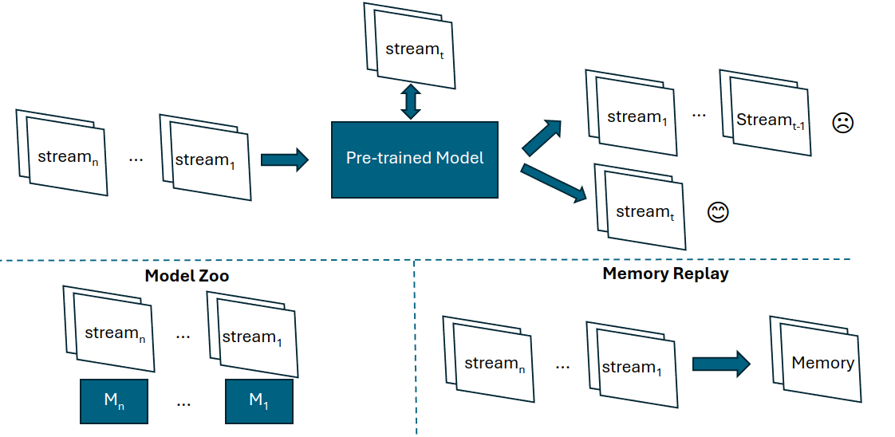

To preserve the accuracy of the deployed models, we often need to continuously update the models. However, naive fine-tuning methods are effective and efficient due to _forgetting, overfitting, and high resource demanding issues_. Thus, we disucss the potential solutions here from algorithm and system perspectives.

## Table of contents
- [Table of contents](#table-of-contents)
- [Algorithms](#algorithms)
- [Syetems](#syetems)
- [Conclusion](#conclusion)
- [References](#references)

## Algorithms
- [ICML 2017] Model-Agnostic Meta-Learning for Fast Adaptation of Deep Networks​
- [NeurIPS'18]  Memory Replay GANs: Learning to Generate New Categories without Forgetting​
- [ICLR'20] Continual learning with hypernetworks​
- [ICLR'22] Model Zoo: A Growing Brain That Learns Continually​
- [ICML'22] Forget-free Continual Learning with Winning Subnetworks​
- [NeurIPS'22] SparCL: Sparse Continual Learning on the Edge​
- [CVPR 2022] Meta-attention for ViT-backed Continual Learning​
- [ICML'23] Lifelong Language Pretraining with Distribution-Specialized Experts​
- [CVPR'23] CODA-Prompt: Continual Decomposed Attention-based Prompting for Rehearsal-Free Continual Learning​
- [CVPR'23] Task Difficulty Aware Parameter Allocation & Regularization for Lifelong Learning​
- [ICCV'23] Self-Evolved Dynamic Expansion Model for Task-Free Continual Learning​
- [ICCV'23] Label-Efficient Online Continual Object Detection in Streaming Video​
- [ICLR'24] Divide and not forget: Ensemble of selectively trained experts in Continual Learning​
- [ICLR'24] Continual Learning on a Diet: Learning from Sparsely Labeled Streams Under Constrained Computation ​
- [ICLR 2024] TiC-CLIP: Continual Training of CLIP Models ​
- [ICLR 2024] Scalable Language Model with Generalized Continual Learning ​
- [ICLR 2024] A Unified and General Framework for Continual Learning​
- [ICLR 2024] Divide and not forget: Ensemble of selectively trained experts in Continual Learning​
- [AAAI'24] Summarizing Stream Data for Memory-Restricted Online Continual Learning​
- [AAAI'24] Evolving Parameterized Prompt Memory for Continual Learning​

## Syetems
1. [ATC'22] SOTER: Guarding Black-box Inference for General Neural Networks at the Edge​
2. [DAC'22] CarM: hierarchical episodic memory for continual learning​
3. [DAC'22] The Larger The Fairer? Small Neural Networks Can Achieve Fairness for Edge Devices​
4. [NSDI'22] Ekya: Continuous Learning of Video Analytics Models on Edge Compute Servers​
5. [SOSP'23] Sia: Heterogeneity-aware, goodput-optimized ML-cluster scheduling​
6. [ATC'23] EnvPipe: Performance-preserving DNN Training Framework for Saving Energy​
7. [ATC'23] Beware of Fragmentation: Scheduling GPU-Sharing Workloads with Fragmentation Gradient Descent​
8. [MobiCom'23] AccuMO: Accuracy-Centric Multitask Offloading in Edge-Assisted Mobile Augmented Reality | Purdue University​
9. [EuroSys'23] Egeria: Efficient DNN Training with Knowledge-Guided Layer Freezing​
10. [MOBICOM'23] Cost-effective On-device Continual Learning over Memory Hierarchy with Miro​
11. [VLDB'23] RALF: Accuracy-Aware Scheduling for Feature Store Maintenance​
12. [VLDB'23] Cache Me If You Can: Accuracy-Aware Inference Engine for Differentially Private Data Exploration​
13. [NSDI'23] ModelKeeper: Accelerating DNN Training via Automated Training Warmup​
14. [NSDI'23] RECL: Responsive Resource-Efficient Continuous Learning for Video Analytics​
15. [DAC'23] Shoggoth: Towards Efficient Edge-Cloud Collaborative Real-Time Video Inference via Adaptive Online Learning​
16. [EuroSys'24] Model Selection for Latency-Critical Inference Serving​
17. [OSDI'24] Caravan: Practical Online Learning of In-Network ML Models with Labeling Agents ​
18. [VLDB'24] Accelerating String-key Learned Index Structures via Memoization-based Incremental Training​
19. [ISCA'24] DACAPO: Accelerating Continuous Learning in Autonomous Systems for Video Analytics​
20. [DAC'24] Enabling On-Device Large Language Model Personalization with Self-Supervised Data Selection and Synthesis​
21. [OSDI'24] Automatic and Efficient Customization of Neural Networks for ML Applications​
22. [NSDI'24] MadEye: Boosting Live Video Analytics Accuracy with Adaptive Camera Configurations​
23. [ASPLOS'24] Proteus: A High-Throughput Inference-Serving System with Accuracy Scaling​
24. [ASPLOS'24] RAP: Resource-aware Automated GPU Sharing for Multi-GPU Recommendation Model Training and Input Preprocessing​
25. [ASPLOS'24] NeuPIMs: NPU-PIM Heterogeneous Acceleration for Batched LLM Inferencing​
26. [ASPLOS'24] SpecInfer: Accelerating Large Language Model Serving with Tree-based Speculative Inference and Verification​
27. [arXiv 2024.01] MoE-Infinity: Activation-Aware Expert Offloading for Efficient MoE Serving​
28. [arXiv 2024.03] Are More LLM Calls All You Need? Towards Scaling Laws of Compound Inference Systems
29. [arXiv 2023.11] S-LoRA: Serving Thousands of Concurrent LoRA Adapters ​
30. [arXiv 2023.10] Punica: Multi-Tenant LoRA Serving​
31. [arXiv 2024.01] CARASERVE: CPU-Assisted and Rank-Aware LoRA Serving for Generative LLM Inference​
32. [arXiv 2024.02] APIServe: Efficient API Support for Large-Language Model Inferencing​
33. [arXiv 2024.02] FlexLLM: A System for Co-Serving Large Language Model Inference and Parameter-Efficient Finetuning​
34. [arXiv 2024.03] ALTO: An Efficient Network Orchestrator for Compound AI Systems​
35. [arXiv 2024.04] Mélange: Cost Efficient Large Language Model Serving by Exploiting GPU Heterogeneity​

​
## Conclusion

## References
​