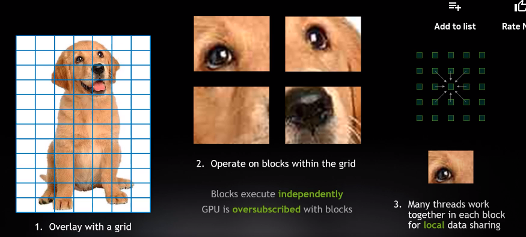
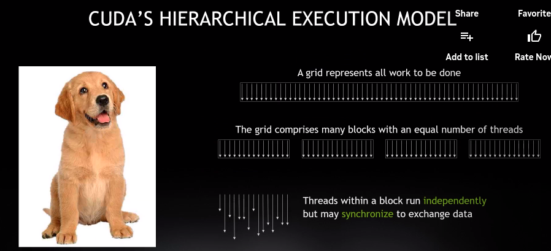
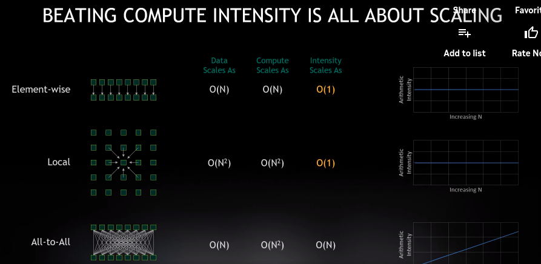

GPU and other AI accelectors make AI models run faster. However, writing efficient parallel computing programs is not easy because it requires a deep understanding of both the hardware and the software. In this section, we will learn how to write efficient CUDA programs for PyTorch models.

## Table of contents
- [Table of contents](#table-of-contents)
- [Background](#background)
  - [GPU Computing](#gpu-computing)
  - [C++ review](#c-review)
  - [CUDA short courses](#cuda-short-courses)
  - [Dive into CUDA](#dive-into-cuda)
- [Profile PyTorch models](#profile-pytorch-models)
- [Use optimized CUDA to accelerate PyTorch models](#use-optimized-cuda-to-accelerate-pytorch-models)
- [References](#references)

## Background

### GPU Computing
[How GPU Computing Works](https://www.nvidia.com/en-us/on-demand/session/gtcspring21-s31151/)

_This lecture gives a high-level introduction to the internels of GPU computing._

### C++ review
[Effective Programming In C And C++](https://ocw.mit.edu/courses/6-s096-effective-programming-in-c-and-c-january-iap-2014/pages/lecture-notes/)

### CUDA short courses
- [TinyEngine and Parallel Processing](https://www.youtube.com/watch?app=desktop&v=gGcbn0ISOJM)
- [Parallel Computing Tutorial](https://github.com/mit-han-lab/parallel-computing-tutorial)
- [6.5940 Fall 2023 Lab 5: Optimize LLM on Edge Devices](https://docs.google.com/document/u/0/d/13IaTfPKjp0KiSBEhPdX9IxgXMIAZfiFjor37OWQJhMM/mobilebasic)

### Dive into CUDA
- [Github Repo] [CUDA-Mode lectures](https://github.com/cuda-mode/lectures)
- [Github Repo] [awesomeMLSys](https://github.com/cuda-mode/awesomeMLSys)

## Profile PyTorch models
- [PyTorch Profiler](https://pytorch.org/tutorials/recipes/recipes/profiler_recipe.html?highlight=profil)
- [Profiling your PyTorch Module](https://pytorch.org/tutorials/beginner/profiler.html?highlight=profiler)
- [PyTorch Profiler With TensorBoard](https://pytorch.org/tutorials/intermediate/tensorboard_profiler_tutorial.html?highlight=profile)

## Use optimized CUDA to accelerate PyTorch models
- [Custom C++ and CUDA Extensions](https://pytorch.org/tutorials/advanced/cpp_extension.html?highlight=cuda)

## References
- [CUDA C++ Best Practices Guide](https://docs.nvidia.com/cuda/cuda-c-best-practices-guide/index.html)

