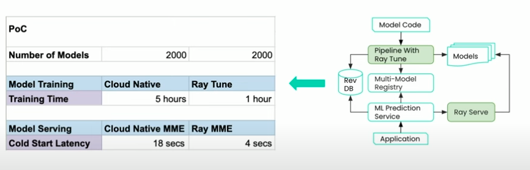

GPU and other AI accelectors make AI models run faster. However, writing efficient parallel computing programs is not easy because it requires a deep understanding of both the hardware and the software. In this section, we will learn how to write efficient CUDA programs for PyTorch models.

## Table of contents
- [Table of contents](#table-of-contents)
- [Background](#background)
  - [GPU Computing](#gpu-computing)
  - [C++ review](#c-review)
  - [Parallel Computing](#parallel-computing)
  - [CUDA short courses](#cuda-short-courses)
  - [Dive into CUDA](#dive-into-cuda)
- [Profile PyTorch models](#profile-pytorch-models)
- [Use optimized CUDA to accelerate PyTorch models](#use-optimized-cuda-to-accelerate-pytorch-models)
- [Distributed Training/Tuning/Serving](#distributed-trainingtuningserving)
- [References](#references)

## Background

### GPU Computing
[How GPU Computing Works](https://www.nvidia.com/en-us/on-demand/session/gtcspring21-s31151/)

_This lecture gives a high-level introduction to the internels of GPU computing._

### C++ review
[Effective Programming In C And C++](https://ocw.mit.edu/courses/6-s096-effective-programming-in-c-and-c-january-iap-2014/pages/lecture-notes/)

### Parallel Computing
[(NYU Spring 2024) Big Data and Machine Learning Systems](https://nyu-mlsys.github.io/) basics of neural networks, how they are programmed and executed by today's deep learning frameworks, automatic differentiation, deep learning accelerators, distributed training techniques, computation graph optimizations, automated kernel generation etc.

### CUDA short courses
- [GPU Programming (Chinese)](https://face2ai.com/program-blog/#GPU)
- [TinyEngine and Parallel Processing](https://www.youtube.com/watch?app=desktop&v=gGcbn0ISOJM)
- [Parallel Computing Tutorial](https://github.com/mit-han-lab/parallel-computing-tutorial)
- [6.5940 Fall 2023 Lab 5: Optimize LLM on Edge Devices](https://docs.google.com/document/u/0/d/13IaTfPKjp0KiSBEhPdX9IxgXMIAZfiFjor37OWQJhMM/mobilebasic)

### Dive into CUDA
- [Github Repo] [CUDA-Mode lectures](https://github.com/cuda-mode/lectures)
  - [Video Lecture] [Lecture 1 How to profile CUDA kernels in PyTorch](https://www.youtube.com/watch?v=LuhJEEJQgUM)
- [Github Repo] [awesomeMLSys](https://github.com/cuda-mode/awesomeMLSys)

## Profile PyTorch models
- [PyTorch Profiler](https://pytorch.org/tutorials/recipes/recipes/profiler_recipe.html?highlight=profil)
- [Profiling your PyTorch Module](https://pytorch.org/tutorials/beginner/profiler.html?highlight=profiler)
- [PyTorch Profiler With TensorBoard](https://pytorch.org/tutorials/intermediate/tensorboard_profiler_tutorial.html?highlight=profile)

## Use optimized CUDA to accelerate PyTorch models
- [Custom C++ and CUDA Extensions](https://pytorch.org/tutorials/advanced/cpp_extension.html?highlight=cuda)

## Distributed Training/Tuning/Serving

_image source: Ray Summit 2023_

- Use Cases
  - [Hands-on Tutorial] [Using PyTorch Lightning with Tune](https://docs.ray.io/en/latest/tune/examples/tune-pytorch-lightning.html#tune-pytorch-lightning-ref).
  - [Hands-on Tutorial] [Train a Pytorch Lightning Image Classifier on Ray](https://docs.ray.io/en/latest/train/examples/lightning/lightning_mnist_example.html)
  - [Hands-on Tutorial] [Serve an Object Detection Model on Ray](https://docs.ray.io/en/latest/serve/tutorials/object-detection.html)
- Advanced Usage
  - [Video Tutorial] [Redesigning Scheduling in Ray to Improve Cost-Efficiency at Scale](https://www.youtube.com/watch?v=zA2bOT7GYew)
  - [Video Tutorial] [Deploying Many Models Efficiently with Ray Serve](https://www.youtube.com/watch?v=QUYucglQzBw)
    - Goal (Efficient Hardware Usage and Operational Overhead)
      - Efficient Hardware Usage (share resources, independent scaling)
      - Operational Overhead (testing, monitoring, independent updates)
    - Best Practices
      - [Deploy Multiple Applications](https://docs.ray.io/en/latest/serve/multi-app.html) + [Run Multiple Applications in Different Containers](https://docs.ray.io/en/latest/serve/advanced-guides/multi-app-container.html#worker-path-field)
      - [Model Multiplexing for Throughput-Optimized Serving](https://docs.ray.io/en/latest/serve/model-multiplexing.html)

## References
- [CUDA C++ Best Practices Guide](https://docs.nvidia.com/cuda/cuda-c-best-practices-guide/index.html)

