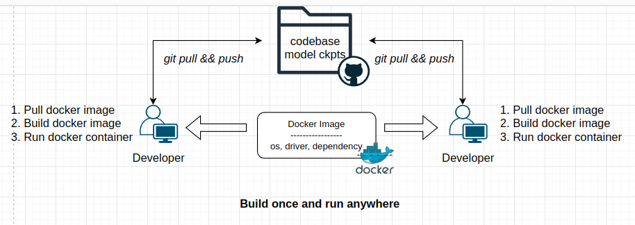

Docker in production ensures consistent, scalable, and secure application deployments, improving reliability, developer productivity, and operational efficiency through containerization, resource optimization, and simplified deployment and rollback processes. Thus, we take a look at how to use docker to deploy and manage AI services.



## Table of contents
- [Table of contents](#table-of-contents)
- [Best practice](#best-practice)
  - [A single service](#a-single-service)
  - [Multiple services](#multiple-services)
- [Build a docker image for your AI services](#build-a-docker-image-for-your-ai-services)
- [Run a docker container with local codebase](#run-a-docker-container-with-local-codebase)
- [Use docker-compose to run/manage multiple AI services](#use-docker-compose-to-runmanage-multiple-ai-services)
- [Conclusion](#conclusion)
- [References](#references)

## Best practice
Docker not only supports a single service but also multi-service deployment. Here are some best practices:

### A single service

1. Write a simple Dockerfile to container your runtime environment (OS, Python, CUDA, requirements.txt, etc).
2. Build a docker image with the Dockerfile.
3. Run a docker container with the docker image.

### Multiple services

1. Write a docker-compose.yml to manage multiple services.
2. Write a Dockerfile for each service.
3. Build docker images for each service.
4. Run docker containers with docker-compose.

> Note: If you target to deliever your service, please copy codebase and model checkpoints to your Dockerfile. If you aim to share your environment, please use mount volumes to load your codebase and model checkpoints in runtime.

## Build a docker image for your AI services
```Dockerfile
# start from official pytorch docker or nvidia docker
# e.g., FROM nvidia/cuda:12.1-cudnn8-runtime-ubuntu22.04
FROM pytorch/pytorch:2.1.0-cuda12.1-cudnn8-runtime

ARG DEBIAN_FRONTEND=noninteractive

# install software with linux commands
RUN apt-get update && apt-get -y install build-essential nasm libx264-dev libv4l-dev ffmpeg libsm6 libxext6

# install dependencies with pip
RUN pip install --upgrade pip setuptools wheel -i https://pypi.tuna.tsinghua.edu.cn/simple

RUN pip install --verbose basicsr==1.4.2 --use-pep517 -i https://mirrors.aliyun.com/pypi/simple

RUN pip install fastapi rich -i https://mirrors.aliyun.com/pypi/simple
```

When you write a Dockerfile, you can build a docker image with the following command:
```bash
docker build -t /path/to/your_docker_image:your_docker_tag .
```

## Run a docker container with local codebase
```bash
docker run -it --rm \
    --gpus all \
    -v /path/to/your_codebase:/app \
    -it \
    --entrypoint /bin/bash \
    -p 8000:8000 \
    your_docker_image:your_docker_tag
```

## Use docker-compose to run/manage multiple AI services
If you have many AI services, you can use docker-compose to run/manage them.

First, create a docker-compose.yml file:
```yaml
version: '3.9'

services:
  service1:
    image: your_docker_image1:your_docker_tag1
    command: python3 /app/service1.py
    ports:
      - 8000:8000
    volumes:
      - /path/to/your_codebase:/app
    depends_on:
      - service2
  service2:
    image: your_docker_image2:your_docker_tag2
    command: python3 /app/service2.py
    ports:
      - 8001:8001
    volumes:
      - /path/to/your_codebase:/app
```
Second, run the following command to start/stop all services.

```bash
docker-compose up # start all services
docker-compose up -d # start all services in background
docker-compose start service1 # start service1
docker-compose restart service1 # restart service1
docker-compose logs -f service1 # check logs of service1
docker-compose down # stop all services
```

## Conclusion
In this blog, we have learned to containize our AI services with docker and docker-compose. In practice, many applications/serives has their own dependencies (e.g., python-3.10 or tensorflow-2.1.0). Thus, using docker container to isolate these environments is recommend. If your application contains many AI services, using docker-compose is a good choice to run/manage/stop them.

## References
1. [Docker Guide](https://docs.docker.com/guides/)
2. [Docker-compose](https://docs.docker.com/compose/)