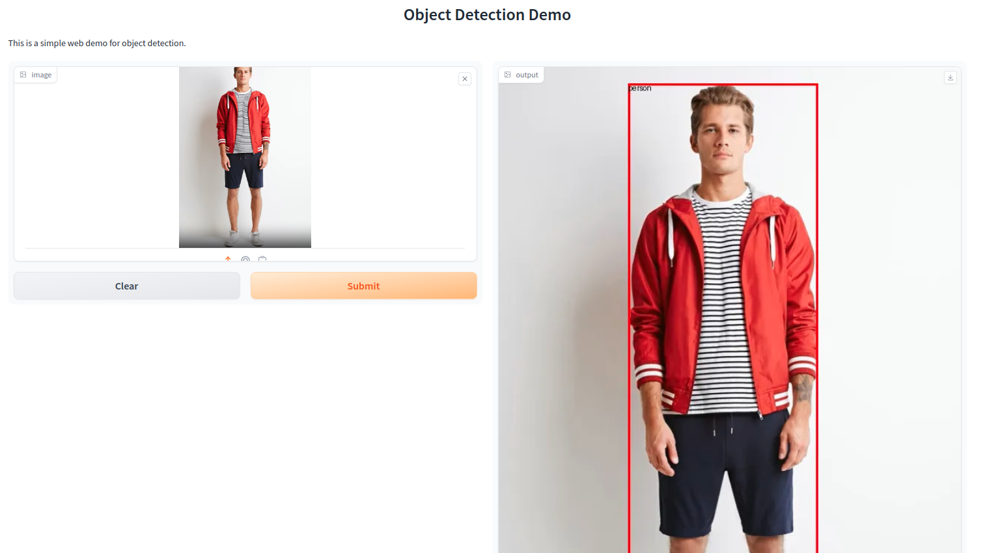
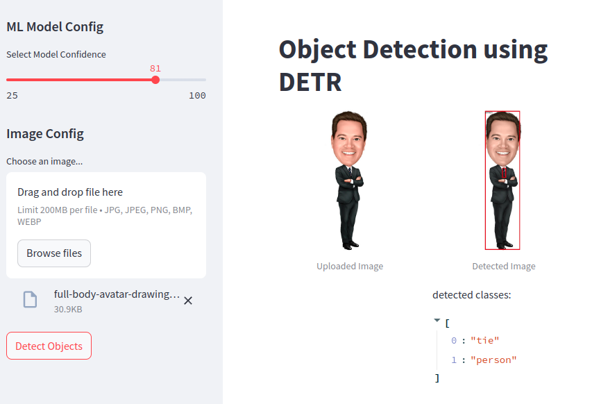

After we got a demo script to run object detection model, we can build a simple webUI within few lines of code.

> If you do not familar with a demo script of object detection, please checkout our previous [blog](https://jason-cs18.github.io/ml-engineering/model_selection.html).

## Table of contents
- [Table of contents](#table-of-contents)
- [Building WebUI with Gradio](#building-webui-with-gradio)
- [Building WebUI with Streamlit](#building-webui-with-streamlit)
- [Conclusion](#conclusion)
- [References](#references)

## Building WebUI with Gradio
[Gradio](https://www.gradio.app/guides/quickstart) is a super-powerful library to build interactive ML web applications. With it, we can build a simple web demo within few lines of code.

```python
import gradio as gr
from transformers import AutoImageProcessor, DetrForObjectDetection
import torch
# import cv2
import numpy as np
from PIL import Image, ImageDraw

model_path = "/mnt/code/model_zoo/detr-resnet-50"
device = "cuda" if torch.cuda.is_available() else "cpu"

# load model and image processor
image_processor = AutoImageProcessor.from_pretrained(model_path)
model = DetrForObjectDetection.from_pretrained(model_path).to(device)

def inference(image): # connect to the backend
    # inference logic
    # image_cv = cv2.imread(image)
    image = Image.open(image)
    draw = ImageDraw.Draw(image)
    # image_cv = np.array(image.convert('RGB'))[:, :, ::-1].copy()
    inputs = image_processor(images=image, return_tensors="pt").to(device)
    with torch.no_grad():
        outputs = model(**inputs)
    
    target_sizes = torch.tensor([image.size[::-1]])
    results = image_processor.post_process_object_detection(outputs, threshold=0.9, target_sizes=target_sizes)[0]
    for score, label, box in zip(results["scores"], results["labels"], results["boxes"]):
        box = [round(i, 2) for i in box.tolist()]
        x1, y1, x2, y2 = box
        x, y, w, h = int(x1), int(y1), int(x2-x1), int(y2-y1)
        # print(x1, x2, y1, y2)
        draw.rectangle((x, y, x + w, y + h), outline="red", width=3)
        draw.text((x, y), model.config.id2label[label.item()], fill="black")
        # demo_image = cv2.rectangle(image_cv, (x, y), (x + w, y + h), (36,255,12), 1)
        # cv2.putText(demo_image, f"{model.config.id2label[label.item()]}", (x, y-10), cv2.FONT_HERSHEY_SIMPLEX, 0.9, (36,255,12), 2)
        
    return image

demo = gr.Interface(
    fn = inference,
    inputs = gr.Image(height=300, type="filepath"),
    outputs = gr.Image(),
    title = "Object Detection Demo",
    description = "This is a simple web demo for object detection."
)

demo.launch(server_name="0.0.0.0", server_port=8805)
```


Although Gradio provides a lot of UI components, it does not support more customization. Thus, you'd better check Gradio UI components before using it.

## Building WebUI with Streamlit
Unlike Gradio, [Streamlit](https://streamlit.io/) is a flexible tool/library to visualize data and build ML web applications. Its code is a little complex than Gradio, but it supports more customizations (e.g., customized layout, custom CSS, etc).



```python
import streamlit as st

import gradio as gr
from transformers import AutoImageProcessor, DetrForObjectDetection
import torch
import numpy as np
from PIL import Image, ImageDraw

default_img_path = "../test_data/000000039769.jpg"
model_path = "/mnt/code/model_zoo/detr-resnet-50"
device = "cuda" if torch.cuda.is_available() else "cpu"

# load model and image processor
image_processor = AutoImageProcessor.from_pretrained(model_path)
model = DetrForObjectDetection.from_pretrained(model_path).to(device)

def inference(image, conf=0.9): # connect to the backend
    draw = ImageDraw.Draw(image)
    # image_cv = np.array(image.convert('RGB'))[:, :, ::-1].copy()
    inputs = image_processor(images=image, return_tensors="pt").to(device)
    with torch.no_grad():
        outputs = model(**inputs)
    
    target_sizes = torch.tensor([image.size[::-1]])
    results = image_processor.post_process_object_detection(outputs, threshold=confidence, target_sizes=target_sizes)[0]
    detected_class = []
    for score, label, box in zip(results["scores"], results["labels"], results["boxes"]):
        box = [round(i, 2) for i in box.tolist()]
        x1, y1, x2, y2 = box
        x, y, w, h = int(x1), int(y1), int(x2-x1), int(y2-y1)
        # print(x1, x2, y1, y2)
        draw.rectangle((x, y, x + w, y + h), outline="red", width=3)
        draw.text((x, y), model.config.id2label[label.item()], fill="black")
        if model.config.id2label[label.item()] not in detected_class:
            detected_class.append(model.config.id2label[label.item()])
        
    return image, detected_class


st.set_page_config(
    page_title="Object Detection using DETR",
    page_icon="🤖",
    layout="wide",
    initial_sidebar_state="expanded"
)

st.title("Object Detection using DETR")

st.sidebar.header("ML Model Config")

confidence = float(st.sidebar.slider(
    "Select Model Confidence", 25, 100, 40)) / 100

st.sidebar.header("Image Config")

source_img = None

source_img = st.sidebar.file_uploader(
    "Choose an image...", type=("jpg", "jpeg", "png", 'bmp', 'webp'))

col1, col2 = st.columns(2)

with col1:
    try:
        if source_img is None:
            default_image_path = default_img_path
            default_image = Image.open(default_image_path)
            st.image(default_image_path, caption="Default Image",
                        use_column_width=True)
        else:
            uploaded_image = Image.open(source_img)
            st.image(source_img, caption="Uploaded Image",
                        use_column_width=True)
    except Exception as ex:
        st.error("Error occurred while opening the image.")
        st.error(ex)

with col2:
    if source_img is None:
        default_detected_image_path = default_img_path
        default_detected_image = Image.open(
            default_detected_image_path)
        st.image(default_detected_image_path, caption='Detected Image',
                    use_column_width=True)
    else:
        if st.sidebar.button('Detect Objects'):
            res, detected_classes = inference(uploaded_image, conf=confidence)
            st.image(res, caption='Detected Image',
                        use_column_width=True)
            # detected = ""
            st.write("detected classes:")
            st.write(detected_classes)
```

<!-- You can check demos and examples on [best-of-streamlit](https://github.com/jrieke/best-of-streamlit). -->

## Conclusion
In this blog, we have learned to build a simple webUI for the object detection model. Usually, Gradio provides more UI components and Streamlit supports more customization. Thus, we recommend using Gradio to build a simple webUI and Streamlit for more complex webUI.

## References
1. [Gradio](https://www.gradio.app/)
2. [Streamlit](https://streamlit.io/#install)