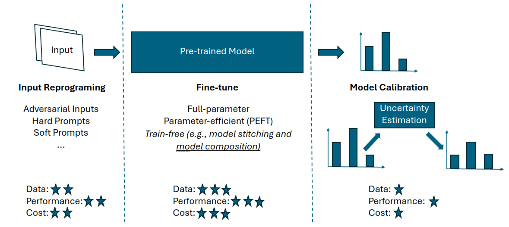

To conduct continuous learning on resource-constrainted devices, efficient learning/transfer algorithms are needed. In this page, we summarize recent representative works and discuss their limitations.

## Table of contents
- [Table of contents](#table-of-contents)
- [Efficient learning](#efficient-learning)
- [Transfer Learning](#transfer-learning)
  - [Input Reprogramming](#input-reprogramming)
  - [Fine-tune](#fine-tune)
  - [Model Calibration](#model-calibration)

## Efficient learning
1. [arXiv 2024.01] The Unreasonable Effectiveness of Easy Training Data for Hard Tasks​
2. [arXiv 2024.03] Branch-Train-MiX: Mixing Expert LLMs into a Mixture-of-Experts LLM​
3. [ICLR'22] Auto-scaling Vision Transformers without Training​
4. [ICLR'22] Fast Model Editing at Scale​
5. [ECCV'22] TinyViT: Fast Pretraining Distillation for Small Vision Transformers​
6. [ECCV'22] MaxViT: Multi-axis Vision Transformer​
7. [CVPR'21] Fast and Accurate Model Scaling​
8. [CVPR'23] FlexiViT: One Model for All Patch Sizes​
9. [ICML'23] Fast Inference from Transformers via Speculative Decoding​
10. [CVPR'23] EfficientViT: Memory Efficient Vision Transformer with Cascaded Group Attention​
11. [arXiv 2023.11] Navigating Scaling Laws: Compute Optimality in Adaptive Model Training​
12. [ICCV'23] TripLe: Revisiting Pretrained Model Reuse and Progressive Learning for Efficient Vision Transformer Scaling and Sea​
13. [ICCV'23] FastViT: A Fast Hybrid Vision Transformer using Structural Reparameterization​
14. [CVPR'22] RepMLP: Re-parameterizing Convolutions into Fully-connected Layers for Image Recognition​
15. [CVPR'21] RepVGG: Making VGG-style ConvNets Great Again​
16. [ICLR'23] Re-parameterizing Your Optimizers rather than Architectures​
17. [Tech Blog] Model Merging: MoE, Frankenmerging, SLERP, and Task Vector Algorithms​

## Transfer Learning

### Input Reprogramming
1. [ICLR'19] Adversarial Reprogramming of Neural Networks​
2. [ICML'20] Transfer Learning without Knowing: Reprogramming Black-box Machine Learning Models with Scarce Data and Limited Resources​
3. [ICML'22] Black-Box Tuning for Language-Model-as-a-Service​
4. [CVPR'22] Rep-Net: Efficient On-Device Learning via Feature Reprogramming​
5. [IJCAI'23] Black-box Prompt Tuning for Vision-Language Model as a Service​
6. [CVPR'23] BlackVIP: Black-Box Visual Prompting for Robust Transfer Learning​
7. [ICASSP'24] Efficient Black-Box Speaker Verification Model Adaptation with Reprogramming and Backend Learning​
8. [arXiv 2024.02] Connecting the Dots: Collaborative Fine-tuning for Black-Box Vision-Language Models

### Fine-tune
1. [ICML'21] Zoo-Tuning: Adaptive Transfer from a Zoo of Models ​
2. [NeurIPS'21] Revisiting Model Stitching to Compare Neural Representations​
3. [ICLR'22] LoRA: Low-Rank Adaptation of Large Language Mode​
4. [EMNLP'22] BBTv2: Towards a Gradient-Free Future with Large Language Models​
5. [ICLR'23] Editing models with task arithmetic​
6. [CVPR'23 Best Paper Award] Visual Programming: Compositional visual reasoning without training​
7. [ICCV'23] A Unified Continual Learning Framework with General Parameter-Efficient Tuning​
8. [ICLR'24] Mixture of LoRA Experts​
9. [ICLR'24] Batched Low-Rank Adaptation of Foundation Models​
10. [arXiv 2023.11] PrivateLoRA For Efficient Privacy Preserving LLM​
11. [arXiv 2024.02] BitDelta: Your Fine-Tune May Only Be Worth One Bit​
12. [arXiv 2024.02] LoraRetriever: Input-Aware LoRA Retrieval and Composition for Mixed Tasks in the Wild​
13. [arXiv 2023.07] LoraHub: Efficient Cross-Task Generalization via Dynamic LoRA Composition​
14. [arXiv 2024.05] Trans-LoRA: towards data-free Transferable Parameter Efficient Finetuning​
15. [arXiv 2023.08] IncreLoRA: Incremental Parameter Allocation Method for Parameter-Efficient Fine-tuning​
16. [arXiv 2024.02] Evolutionary Optimization of Model Merging Recipes

### Model Calibration
1. [NeurIPS'21] Revisiting the Calibration of Modern Neural Networks​
2. [EMNLP'23] CombLM: Adapting Black-Box Language Models through Small Fine-Tuned Models​
3. [CVPR'24] Efficient Test-Time Adaptation of Vision-Language Models​