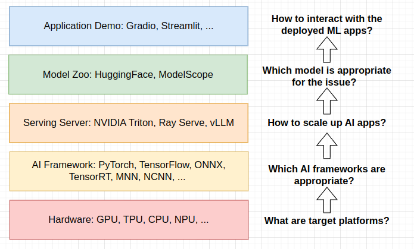

ML engineering often refers to the process of building and maintaining machine learning models. Thus, it is also similar to MLOps. From my perspective, it is also an standard workflow to build a machine learning model in production.

In my notes, we start from model selection, then model training, and finally model deployment.

## ML application development
Today, building a simple ML application is easy and could be implemented within 100-lines code. It is because a lot of frameworks/tools abstract the complex development logic and provide APIs for users. Thus, understanding these tools is important to ML developers. The above image shows an standard ML application development stack. In other blogs, I will present how to use these tools to build a simple object detection application.

## Quickstart
1. [Find a suitable model for your needs](https://jason-cs18.github.io/ml-engineering/model_selection.html)
2. [Build a simple interactive web demo](https://jason-cs18.github.io/ml-engineering/web_demo.html)

## Dive into model training
1. [Train a DETR model with Ray Train and PyTorch-Lightning](https://jason-cs18.github.io/ml-engineering/detr_train.html)
2. [Hyperparameter tuning with Ray Tune and Optuna](https://jason-cs18.github.io/ml-engineering/detr_tune.html)

## Let's make models fast
1. [Accelerate PyTorch Models with ONNX and TensorRT](https://jason-cs18.github.io/ml-engineering/inference_engine.html)
2. [Serve a model with Ray Serve and NVIDIA Triton](https://jason-cs18.github.io/ml-engineering/inference_server.html)

## Monitor and debug deployed models
1. [Using Ray Dashboard to monitor and debug models](https://jason-cs18.github.io/ml-engineering/monitor.html)

## Engineering Tools
1. [Build a simple web backend with FastAPI](https://jason-cs18.github.io/ml-engineering/fastapi.html)
2. [Manage your AI services with docker and docker-compose](https://jason-cs18.github.io/ml-engineering/docker.html)