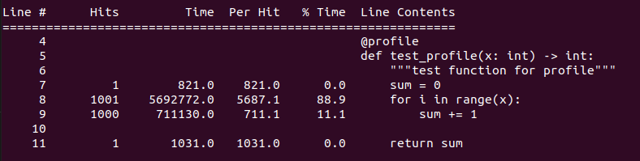
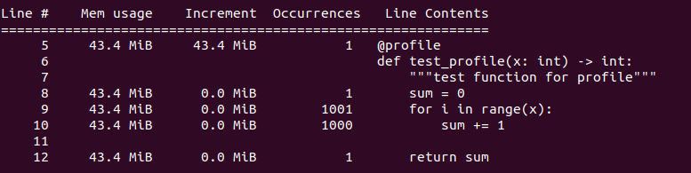
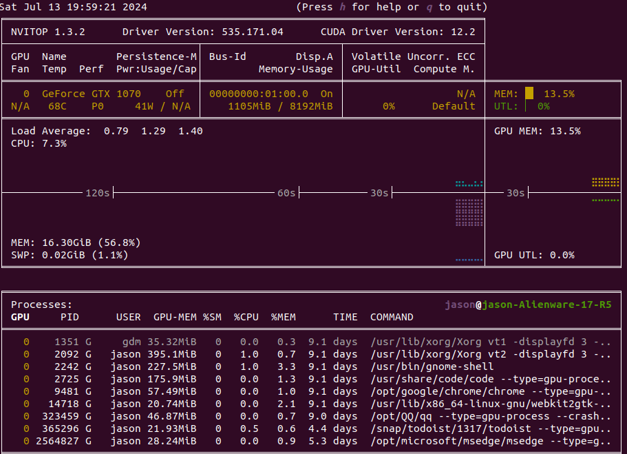
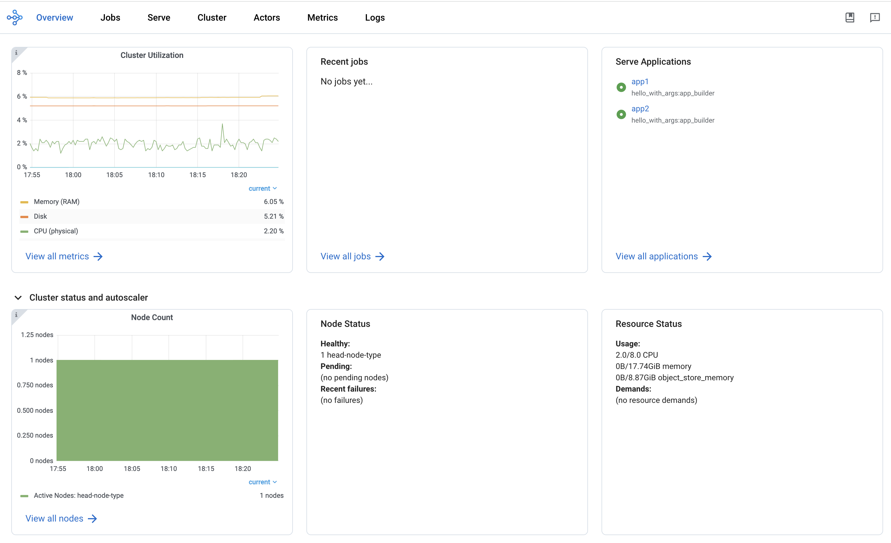

To make sure our code is running as expected, we need to monitor the time and memory usage of our Python scripts, monitor the GPU usage, and monitor the performance of our PyTorch scripts.

In this blog, we will learn how to profile Python scripts, monitor GPU usage, use PyTorch Profiler to profile PyTorch scripts, monitor DETR with Ray Dashboard, and add accuracy metrics to Ray Dashboard.

## Table of contents
- [Table of contents](#table-of-contents)
- [Profile time \& memory for Python scripts](#profile-time--memory-for-python-scripts)
- [Monitor GPU with nvitop](#monitor-gpu-with-nvitop)
- [Use PyTorch Profiler to profile PyTorch scripts](#use-pytorch-profiler-to-profile-pytorch-scripts)
- [Monitor DETR with Ray Dashboard](#monitor-detr-with-ray-dashboard)
- [Conclusion](#conclusion)

## Profile time & memory for Python scripts

```python
# pip install line_profiler
# LINE_PROFILE=1 python test_profile.py
# pip install memory-profiler
# python test_profile.py

"""
test_profile.py
"""
import math
from line_profiler import profile
# from memory_profiler import profile

@profile
def test_profile(x: int) -> int:
    """test function for profile"""
    sum = 0
    for i in range(x):
        sum += 1
    
    return sum


def main():
    test_profile(1000)
    

if __name__ == "__main__":
    main()
```






## Monitor GPU with nvitop
```bash
pip install -U nvitop
nvitop # start monitoring
```


## Use PyTorch Profiler to profile PyTorch scripts
Usually, nvitop only provides a coarse-level view of GPU usage, and we need to use [PyTorch Profiler](https://pytorch.org/tutorials/recipes/recipes/profiler.html) to get more detailed information. For example, we can find the most time-consuming operators in PyTorch Profiler logs and visualize the GPU utilization on each operators.

- [系统调优助手，PyTorch Profiler TensorBoard 插件教程](https://blog.csdn.net/just_sort/article/details/137784877)
- [PyTorch Profiler With TensorBoard](https://pytorch.org/tutorials/intermediate/tensorboard_profiler_tutorial.html)
- [Visualizing Models, Data, and Training with TensorBoard](https://pytorch.org/tutorials/intermediate/tensorboard_tutorial.html)

## Monitor DETR with Ray Dashboard
Besides monitoring the time and memory usage of a single Pytorch model, we also need to monitor and debug all running AI jobs. To this end, we use Ray Dashboard to check running logs and analyze hardware utilization.



- [Ray Dashboard](https://docs.ray.io/en/latest/ray-observability/getting-started.html#ray-dashboard)

<!-- ### Add accuracy metrics to Ray Dashboard -->


## Conclusion
In this blog, we have learned to profile simple python scripts and Pytorch models. In the end, we studied to monitor AI applications or jobs through Ray Dashboard.