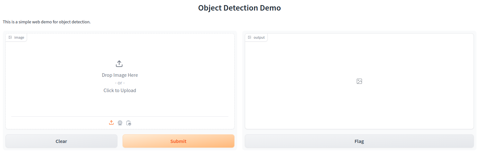

After we got a demo script to run object detection model, we can build a simple webUI within few lines of code.

> If you do not familar with a demo script of object detection, please checkout our previous [blog](https://jason-cs18.github.io/ml-engineering/model_selection.html).

## Table of contents
- [Table of contents](#table-of-contents)
- [Building WebUI with Gradio](#building-webui-with-gradio)
- [Building WebUI with Streamlit](#building-webui-with-streamlit)
- [Conclusion](#conclusion)
- [References](#references)

## Building WebUI with Gradio
[Gradio](https://www.gradio.app/guides/quickstart) is a super-powerful library to build interactive ML web applications. With it, we can build a simple web demo within few lines of code.

```python
# inference demo (object detection)
import gradio as gr

demo_image = "/mnt/data/production_template/DLTK/dlapp_template/scripts/web_app/temp/000560.png" # replace with your image path

def inference(image): # connect to the backend
    # inference logic
    # tag results on image
    return demo_image

demo = gr.Interface(
    fn = inference,
    inputs = gr.Image(height=300),
    outputs = gr.Image(height=300),
    title = "Object Detection Demo",
    description = "This is a simple web demo for object detection."
)

demo.launch(server_port=8333)
```


Although Gradio provides a lot of UI components, it does not support more customization. Thus, you'd better check Gradio UI components before using it.

## Building WebUI with Streamlit
Unlike Gradio, [Streamlit](https://streamlit.io/) is a flexible tool/library to visualize data and build ML web applications. Its code is a little complex than Gradio, but it supports more customizations.

You can check demos and examples on [best-of-streamlit](https://github.com/jrieke/best-of-streamlit).

## Conclusion
In this blog, we have learned to build a simple webUI for the object detection model. Usually, Gradio provides more UI components and Streamlit supports more customization. Thus, we recommend using Gradio to build a simple webUI and Streamlit for more complex webUI.

## References
1. [Gradio](https://www.gradio.app/)
2. [Streamlit](https://streamlit.io/#install)